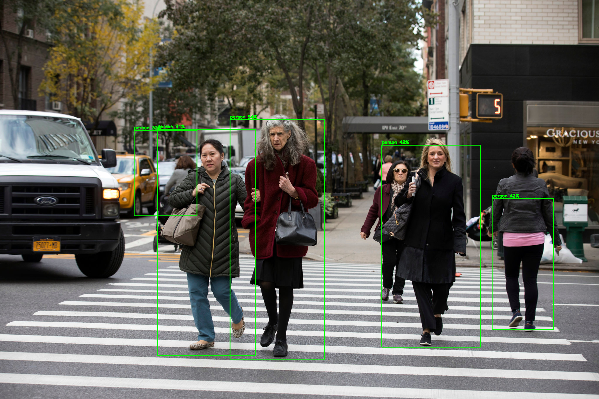
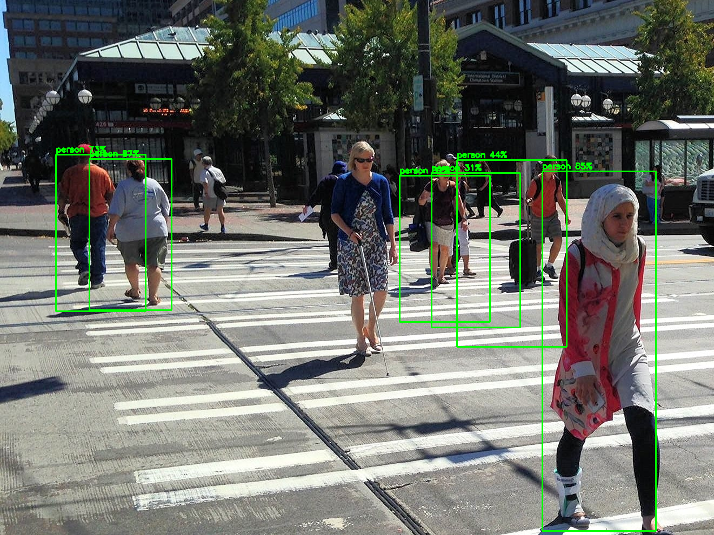
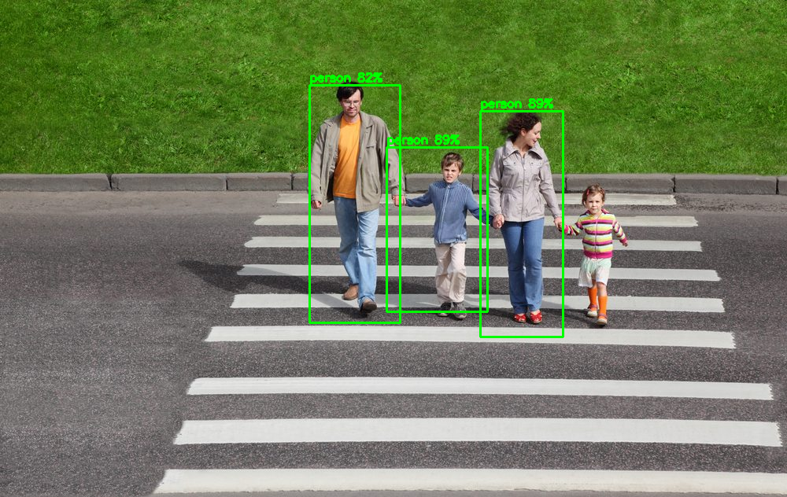
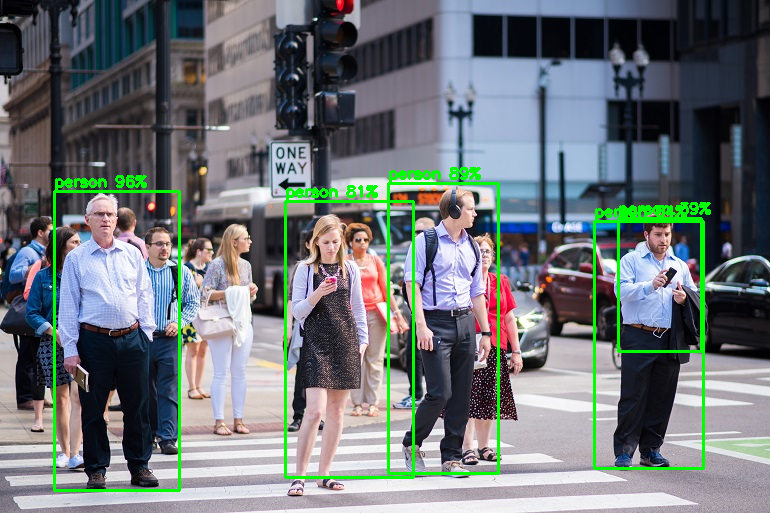
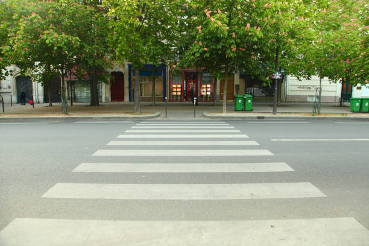

# CPE 462 Final Project

[Report](./assets/Report.pdf)

[Thomas Wang](https://github.com/twang1905), [Mitchell Reiff](https://github.com/MAPReiff), and [Peter Shikhman](https://github.com/Petershik).
## About
The objective of this project was originally to create a program which could detect if cars were waiting at an intersection and appropriately make decisions about changing traffic lights according to the demand. While doing research for the project, the group found many examples of using OpenCV with both C++ and Python in order to detect objects in an image, which was used as the inspiration for developing our solution. The tools used to complete this assignment were C++ with OpenCV, to input and display the images, and TensorFlow, to detect the objects in the images. While the pre-trained models were able to detect cars without issues, the group was not able to replicate such accuracy. As a result, the decision was made to pivot from detecting cars waiting at intersections to detecting if pedestrians were still in the crosswalk before changing traffic lights. When testing, a combination of images from Google Images, screenshots of live IP cameras from insecam.org, as well as our own pictures were used. The compiled program can be run with a single parameter, which is supposed to be the path to the image file used, and it will both display the image with overlaid information about any detected objects, as well as print the final verdict to the console.

## Ussage
Personally, I use Linux, and the following are instructions about how to compile and run the program.

Make sure you have [OpenCV](https://opencv.org/) and C++ installed. Clone this repository to your local system, and navigate to the downloaded directory in your terminal. To compile, run the following command `g++ $(pkg-config --cflags opencv4) project.cc $(pkg-config --libs opencv4)`. To run the program, execute `./a.out` followed by a path to an image file, such as one of the ones in the sampleImages directory.
## Demos
The following 5 examples shows that the system is capable of detecting people present in crosswalks.

The following example shows that the system is also able to process an empty crosswalk without falsely flagging other objects.

